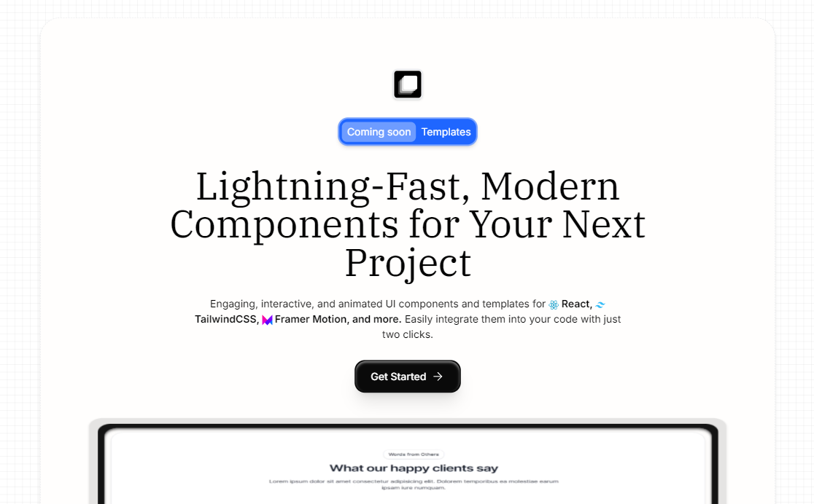

<h2 align="center">Layer UI</h2>
<h4 align="center">
    Lightning-Fast, Modern Components for Your Next Project
</h4>

Welcome to LayerUI – your one-stop solution for sleek, efficient, and modern UI components! Whether you're building from scratch or enhancing an existing project, our components make it 10x Faster, Better, and Modern.  

### ⭐ GitHub Repository  
  

> Join our growing community! Explore the repository, leave a ⭐, and contribute to making LayerUI even better.

### 📲 Follow Us on Twitter  
  

Stay updated with the latest releases and announcements!

## Contributing
Contributions are welcome! If you'd like to add new components or features, Please read the [contributing guide](/CONTRIBUTING.md).

## Let's talk
